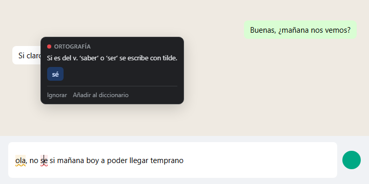
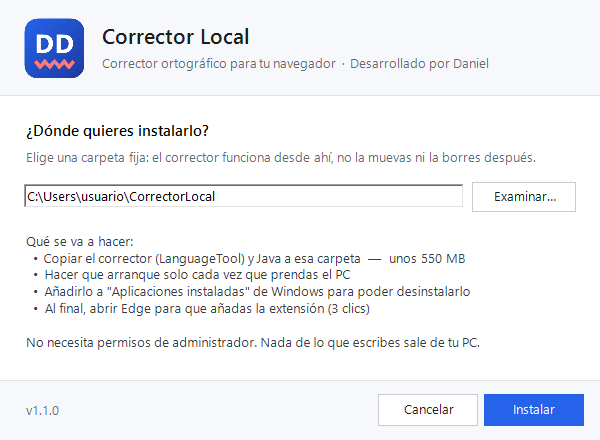
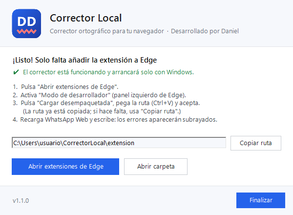

<p align="center">
  
</p>

<h1 align="center">Corrector Local</h1>

<p align="center">
  Corrector ortográfico y gramatical para el navegador que funciona <b>100 % en tu PC</b>.<br>
  Sin cuentas, sin suscripciones y sin enviar lo que escribes a internet.<br>
  <sub>Desarrollado por Daniel</sub>
</p>

<p align="center">
  
</p>

---

## ¿Qué es?

**Corrector Local** subraya los errores mientras escribes en el navegador (WhatsApp Web, Gmail, Outlook, Google Sheets, formularios, redes sociales…) y te propone la corrección con un clic.

Usa por debajo **[LanguageTool](https://github.com/languagetool-org/languagetool)**, el motor de corrección de código abierto, ejecutándose como un servidor local en tu propio equipo. Nace como alternativa a la extensión oficial de LanguageTool, que desde 2026 es solo para usuarios de pago.

### Qué detecta

| Tipo | Ejemplos |
|---|---|
| 🔴 **Ortografía** | `se` → `sé`, `esta` → `está`, `echo` → `hecho` |
| 🟡 **Confusiones por contexto** | `ola` → `hola`, `me boy` → `me voy`, `haber si` → `a ver si` |
| 🟡 **Gramática y estilo** | concordancia, mayúsculas, signos de puntuación |

### Características

- ✍️ Subrayado en tiempo real mientras escribes.
- 🖱️ Clic en la palabra → sugerencias → se reemplaza sola.
- 📖 Diccionario personal ("Añadir al diccionario") e "Ignorar".
- 🌐 Español, español con voseo, inglés, portugués o detección automática.
- 🔒 Privado: el texto nunca sale de tu PC.
- 🚀 Arranca solo con Windows y usa como máximo 2 GB de RAM.
- 🧩 Funciona en **Microsoft Edge** y **Google Chrome**.

---

## Instalación

### 1. Descarga e instala

Descarga **`Instalador Corrector Local.exe`** desde la sección [**Releases**](../../releases/latest) y ejecútalo.

<p align="center">
  
</p>

- Acepta la licencia y elige la carpeta donde se instalará (por defecto `C:\Users\<usuario>\CorrectorLocal`).
- Se crean accesos en **Inicio → Corrector Local** (carpeta, léeme, licencias y desinstalar).
- **No necesita permisos de administrador.** Ocupa unos 550 MB (incluye Java y LanguageTool).
- Si Windows muestra *"Windows protegió su PC"*: **Más información → Ejecutar de todas formas** (el instalador no tiene firma digital de pago).

### 2. Añade la extensión al navegador

Los navegadores no permiten que un programa instale extensiones por su cuenta, así que este paso es manual (solo una vez):

<p align="center">
  
</p>

| | Microsoft Edge | Google Chrome |
|---|---|---|
| 1 | Abre `edge://extensions` (o pulsa **Abrir extensiones de Edge** en el instalador) | Abre `chrome://extensions` |
| 2 | Activa **Modo de desarrollador** (panel izquierdo) | Activa **Modo de desarrollador** (arriba a la derecha) |
| 3 | **Cargar desempaquetada** → pega la ruta (ya está copiada) | **Cargar descomprimida** → elige la carpeta `extension` |

Recarga la página donde escribes y listo.

> 💡 Si tenías la extensión oficial de LanguageTool, quítala: por seguridad el servidor solo atiende a la extensión Corrector Local.
> En Chrome, si aparece el aviso *"Desactivar extensiones en modo de desarrollador"*, ciérralo con la **X**.

---

## Uso

1. Escribe normalmente. Medio segundo después de parar, los errores se subrayan.
2. Haz clic en una palabra subrayada para ver la explicación y las sugerencias.
3. Pulsa una sugerencia para reemplazarla, o **Ignorar** / **Añadir al diccionario**.

El icono **DD** de la barra del navegador muestra si el servidor está funcionando y permite:
activar/desactivar el corrector, cambiar el idioma y gestionar tu diccionario personal.

## Desinstalar

**Configuración → Aplicaciones → Aplicaciones instaladas → Corrector Local → Desinstalar.**
Después quita la extensión en `edge://extensions` o `chrome://extensions`.

---

## Cómo funciona

```
 Navegador (Edge / Chrome)                         Tu PC
┌──────────────────────────────┐           ┌──────────────────────────┐
│ content.js                   │           │ Servidor LanguageTool    │
│  • detecta el campo de texto │  mensaje  │ http://127.0.0.1:8081    │
│  • subraya los errores       │ ────────► │  • Java 21 portátil      │
│  • muestra sugerencias       │           │  • arranca con Windows   │
│ background.js ───────────────┼── HTTP ──►│  /v2/check               │
└──────────────────────────────┘           └──────────────────────────┘
```

- **`extension/`**: extensión Manifest V3.
  - `content.js` vigila los campos editables. En editores enriquecidos (WhatsApp Web, Gmail) subraya con la [CSS Custom Highlight API](https://developer.mozilla.org/docs/Web/API/CSS_Custom_Highlight_API), sin tocar el HTML del editor. En `<textarea>` / `<input>` usa una capa espejo transparente.
  - Los reemplazos usan `execCommand('insertText')`, así editores como Lexical (WhatsApp) registran el cambio correctamente.
  - `background.js` hace las peticiones al servidor local.
- **Servidor**: LanguageTool en modo HTTP, lanzado por `iniciar-servidor.bat` con el Java incluido.
- **`instalador/`**: instalador en C# (WinForms) compilado con el `csc.exe` que trae Windows; lleva todo el paquete dentro.

## Compilar desde el código

Requisitos: Windows 10/11 (el compilador de C# viene con Windows).

```powershell
git clone https://github.com/juanda-lab/corrector-ortogr-fico-local.git
cd corrector-ortogr-fico-local

# Descarga Java 21 y LanguageTool (unos 290 MB)
powershell -ExecutionPolicy Bypass -File preparar.ps1

# Genera "Instalador Corrector Local.exe" en la carpeta superior
powershell -ExecutionPolicy Bypass -File instalador\construir.ps1
```

Para probar sin instalador: ejecuta `iniciar-servidor.bat` y carga la carpeta `extension` en el navegador.

### Compilación automática y publicación de versiones

El flujo [`.github/workflows/compilar.yml`](.github/workflows/compilar.yml) compila en los servidores de GitHub (gratis en repositorios públicos):

- **Probar:** pestaña **Actions → Compilar → Run workflow**. Al terminar, los archivos se descargan desde la ejecución (sección *Artifacts*).
- **Publicar una versión:** sube la versión en `extension/manifest.json`, `instalador/Instalador.cs` y `CHANGELOG.md`, haz commit y crea la etiqueta:
  ```powershell
  git tag v1.3.0
  git push origin v1.3.0
  ```
  GitHub compila y crea la Release con el instalador y el paquete de la extensión.

### Estructura

```
├── extension/             Extensión del navegador (Edge / Chrome)
├── instalador/            Código del instalador .exe y script de compilación
├── docs/                  Imágenes del README
├── iniciar-servidor.bat   Arranca el servidor mostrando una ventana
├── detener-servidor.bat   Detiene el servidor
├── instalar.bat           Instalación manual (sin .exe)
├── desinstalar.bat        Desinstalación
├── server.properties      Configuración del servidor
├── preparar.ps1           Descarga Java y LanguageTool
└── LEEME.txt              Instrucciones incluidas en la instalación
```

## Limitaciones

- **Google Docs** no es compatible (no usa campos de texto normales).
- En **Google Sheets** solo subraya mientras editas una celda: al pulsar Enter, Sheets dibuja la celda como imagen.
- La extensión se carga en **modo desarrollador**; algunos equipos de empresa lo bloquean por política.
- Las funciones de pago de LanguageTool basadas en IA (reescritura, cambio de tono) no están incluidas.
- Para mejorar la detección de confusiones (`a`/`ha`, `tubo`/`tuvo`…) se pueden añadir los [n-gramas de LanguageTool](https://dev.languagetool.org/finding-errors-using-n-gram-data) (varios GB) y activarlos en `server.properties`.

---

## Créditos y licencias

- Código de este proyecto: [MIT](LICENSE) © 2026 Daniel Diaz.
- Privacidad: [PRIVACY.md](PRIVACY.md) · Seguridad: [SECURITY.md](SECURITY.md) · Cambios: [CHANGELOG.md](CHANGELOG.md) · Terceros: [THIRD-PARTY-NOTICES.txt](THIRD-PARTY-NOTICES.txt)
- [LanguageTool](https://languagetool.org) — LGPL 2.1. Se distribuye sin modificar dentro del instalador.
- [Eclipse Temurin](https://adoptium.net) (Java 21) — GPLv2 con Classpath Exception.

Este proyecto no está afiliado a LanguageTooler GmbH. "LanguageTool" es una marca de sus respectivos dueños.

<p align="center"><sub>Desarrollado por <b>Daniel</b></sub></p>
